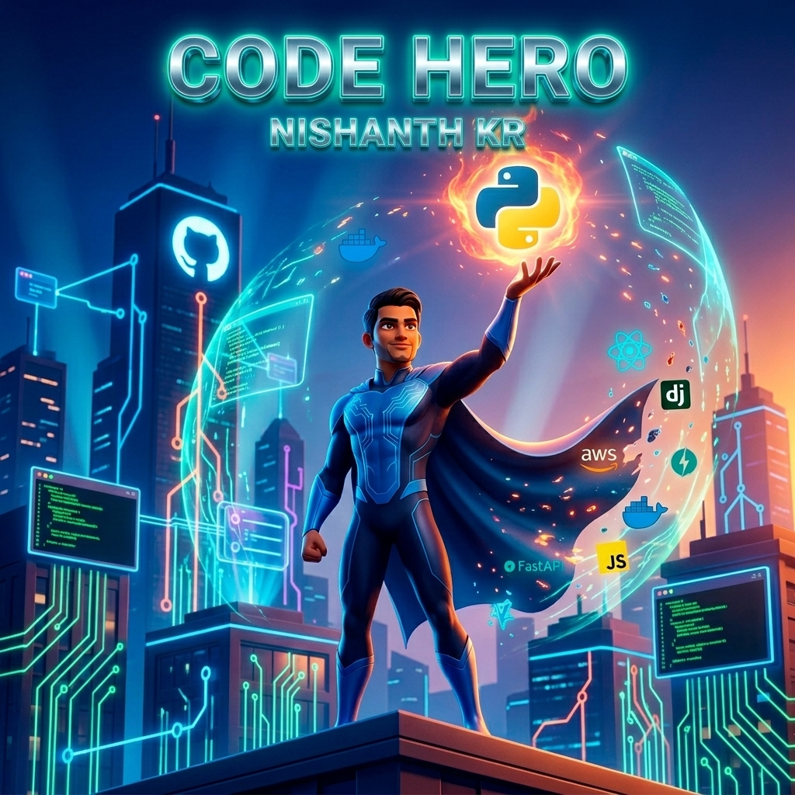

<!-- ═══════════════════════════════════════════════════════════════════════════════ -->
<!--                         🦸 NISHANTH KR — SUPERHERO README 🦸                   -->
<!-- ═══════════════════════════════════════════════════════════════════════════════ -->

<div align="center">

<!-- ─────────────────── ANIMATED HEADER WAVE ─────────────────── -->


<!-- ─────────────────── TYPING EFFECT ─────────────────── -->

<a href="https://git.io/typing-svg">
  
</a>

<br/>

<!-- ─────────────────── SOCIAL BADGES ─────────────────── -->

<p>
  <a href="https://github.com/nijjukrr"></a>&nbsp;
  <a href="https://www.linkedin.com/in/nishanth-kr-6105a2380/"></a>&nbsp;
  <a href="mailto:nijjukrr@gmail.com"></a>
</p>


</div>

<br/>

<!-- ═══════════════════════════════════════════════════════════════════════════════ -->
<!--                          🎨 SUPERHERO POSTER SECTION                          -->
<!-- ═══════════════════════════════════════════════════════════════════════════════ -->

<div align="center">



<br/>

<i>⚡ "With great code comes great responsibility" ⚡</i>

</div>

<br/>

<!-- ═══════════════════════════════════════════════════════════════════════════════ -->
<!--                              🧬 ABOUT ME SECTION                              -->
<!-- ═══════════════════════════════════════════════════════════════════════════════ -->


##  About Me

```yaml
name: Nishanth KR
located_in: India 🇮🇳
current_role: Full Stack Developer | Software Engineer | Backend Developer

education:
  - "Computer Science & Engineering"

fields_of_interest:
  - "Full Stack Web Development"
  - "Backend Engineering"
  - "Cloud Architecture & DevOps"
  - "AI/ML & LLM Engineering"
  - "System Design"
  - "Prompt Engineering"

currently_working_on:
  - "Building scalable backend systems"
  - "Exploring LLMs and Vector Databases"
  - "Contributing to open source"

currently_learning:
  - "Advanced System Design Patterns"
  - "LLM Fine-tuning & RAG Pipelines"
  - "Kubernetes & Cloud-Native Architecture"

hobbies:
  - "Coding side projects"
  - "Tech blogging"
  - "Open source contributing"

fun_fact: "I debug in production... just kidding! 😄"
```

<br/>

<!-- ─────────────────── QUICK STATUS ─────────────────── -->

### 🔭 What I'm Up To

- 🔥 **Currently Building:** Scalable microservices with FastAPI + Docker + K8s
- 🌱 **Currently Learning:** LLM Fine-tuning, RAG Pipelines & Advanced System Design
- 👯 **Looking to Collaborate:** Open source backend / full-stack projects
- 💬 **Ask Me About:** Python, Django, FastAPI, React, AWS, System Design
- 📫 **Reach Me At:** [nijjukrr@gmail.com](mailto:nijjukrr@gmail.com)
- ⚡ **Fun Fact:** I automate everything — even my GitHub profile has a snake eating my contributions!

<br/>

<!-- ═══════════════════════════════════════════════════════════════════════════════ -->
<!--                           🛠️ TECH STACK / SKILLS                              -->
<!-- ═══════════════════════════════════════════════════════════════════════════════ -->


##  Tech Stack & Skills

<div align="center">

### 🐍 Backend & Languages
<p>
  
</p>
<p>
  
  
  
  
  
</p>

### ⚛️ Frontend
<p>
  
</p>
<p>
  
  
  
  
  
  
</p>

### ☁️ Cloud & DevOps
<p>
  
</p>
<p>
  
  
  
  
  
  
</p>

### 🗄️ Databases
<p>
  
</p>
<p>
  
  
  
  
</p>

### 🤖 AI / ML & LLM
<p>
  
</p>
<p>
  
  
  
  
  
  
</p>

### 🧰 Tools & Platforms
<p>
  
</p>

</div>

<br/>

<!-- ═══════════════════════════════════════════════════════════════════════════════ -->
<!--                         📊 GITHUB ANALYTICS SECTION                           -->
<!-- ═══════════════════════════════════════════════════════════════════════════════ -->


##  GitHub Analytics

<div align="center">

<p>
  
  
</p>


<br/><br/>

<!-- GitHub Trophies -->


</div>

<br/>

<!-- ═══════════════════════════════════════════════════════════════════════════════ -->
<!--                        📈 CONTRIBUTION GRAPH                                  -->
<!-- ═══════════════════════════════════════════════════════════════════════════════ -->


## 📈 Contribution Graph

<div align="center">


</div>

<br/>

<!-- ═══════════════════════════════════════════════════════════════════════════════ -->
<!--                         🚀 FEATURED PROJECTS                                -->
<!-- ═══════════════════════════════════════════════════════════════════════════════ -->


## 🚀 Featured Projects

<div align="center">

<a href="https://github.com/nijjukrr/AI-Gym-Fitness-Assistant">
  
</a>
<a href="https://github.com/nijjukrr/COURSERA-2.0">
  
</a>

<br/>

<a href="https://github.com/nijjukrr/number-prediction">
  
</a>
<a href="https://github.com/nijjukrr/HEALTH-SURVEY-SYSTEM">
  
</a>

</div>

<br/>

<!-- ═══════════════════════════════════════════════════════════════════════════════ -->
<!--                         🐍 SNAKE ANIMATION                                    -->
<!-- ═══════════════════════════════════════════════════════════════════════════════ -->


## 🐍 Watch My Contributions Get Eaten

<div align="center">

<picture>
  <source media="(prefers-color-scheme: dark)" srcset="https://raw.githubusercontent.com/nijjukrr/nijjukrr/output/github-snake-dark.svg" />
  <source media="(prefers-color-scheme: light)" srcset="https://raw.githubusercontent.com/nijjukrr/nijjukrr/output/github-snake.svg" />
  
</picture>

</div>

<br/>

<!-- ═══════════════════════════════════════════════════════════════════════════════ -->
<!--                          💡 RANDOM DEV QUOTE                                  -->
<!-- ═══════════════════════════════════════════════════════════════════════════════ -->


<div align="center">

### 💬 Random Dev Quote


</div>

<br/>

<!-- ═══════════════════════════════════════════════════════════════════════════════ -->
<!--                          🤝 LET'S CONNECT                                    -->
<!-- ═══════════════════════════════════════════════════════════════════════════════ -->


<div align="center">

## 🤝 Let's Connect & Build Together

<p>
  <i>I'm always open to collaborating on interesting projects, discussing tech, or just geeking out about code!</i>
</p>

<p>
  <a href="https://github.com/nijjukrr"></a>&nbsp;
  <a href="https://www.linkedin.com/in/nishanth-kr-6105a2380/"></a>&nbsp;
  <a href="mailto:nijjukrr@gmail.com"></a>
</p>

<br/>

<!-- ═══════════════════════════════════════════════════════════════════════════════ -->
<!--                          ☕ SUPPORT SECTION                                   -->
<!-- ═══════════════════════════════════════════════════════════════════════════════ -->


### ☕ Support My Work

<p>
  <i>If you find my projects useful or enjoy my work, consider buying me a coffee! ☕</i>
</p>

<a href="https://buymeacoffee.com/nijjukrr">
  
</a>

</div>

<br/>

<div align="center">


<br/>

<p>
  
  &nbsp;
  
  &nbsp;
  
</p>

</div>

<!-- ═══════════════════════════════════════════════════════════════════════════════ -->
<!--                     ⭐ Star this repo if you liked it! ⭐                      -->
<!-- ═══════════════════════════════════════════════════════════════════════════════ -->
